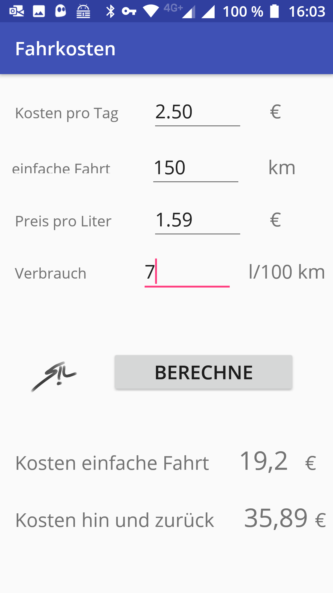

# Fahrkosten
> Calculate the real costs for a trip with your car. Including taxes and insurance.

You have to calculate your taxes and insurance costs once per day. So you can see how much your car costs even if you don´t drive.




## Execute

Android:

```csharp
Install Fahrkosten.apk
```

or

```java
Android Studio: Build APK
```


## **Technologies**

Created with

- [ ] Android Studio 3.4
- [ ] Typora

Programming language:

- [ ] Java

Application style:

- [ ] Android App

  

## Release History

* 1.1
  
    * RELEASE: latest
    
* 1.0
  
    * Work in progress
    
      

## Meta

Marcus Greiner – marcusGreiner@ITsmus.de

[https://github.com/velotist/Fahrkosten](https://github.com/dbader/)

